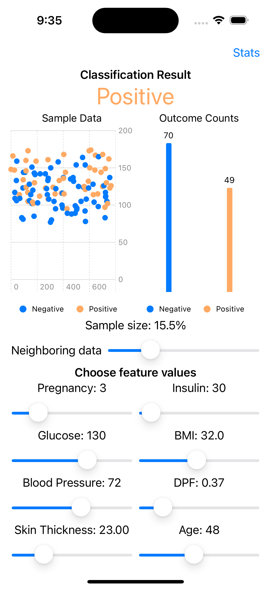
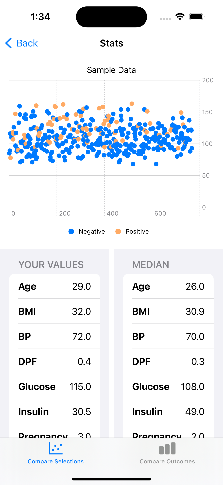

# ML Playground
The purpose of this app is to discover:

1. How can ML models be adapted to run on the iPhone?
1. What are intuitive ways of interacting with those models?
1. Can a mobile app make discovering relationships with the data and machine learning model easier for both technical and non-technical users?

A random forest classifier is trained on a sample of data from the well-known Pima Indians Database [here](https://www.kaggle.com/datasets/uciml/pima-indians-diabetes-database).  Apple's Core ML tools library is used to translate a Python model to the Core ML format, and their documentation is [here](https://apple.github.io/coremltools/docs-guides/source/overview-coremltools.html).  The iOS app itself is written in Swift, using SwiftUI with the Charts and CoreML libaries.

# App Interface
## Main screen

- Sliders under the "Choose feature values" section allow for testing model predictions with different values for each feature
- The charts update to reflect data that nearly matches the user's selections
- The visible data can be increased by increasing the neighboring data slider

## Stats screens
### Compare selections

- Compare current selections made on main screen to median, min and max values of sampled data
- Scroll values on both left and right sides of screen

### Compare outcomes

- Compare sampled data's median, min and max values by positive/negative outcome
- Scroll values on both left and right sides of screen

# Swift / Python files
This project makes use of Python to create the model and SwiftUI to interface with it

## Updating / deploying model
To make edits to the model and export it in the core ML format, use the notebook file at python_data/feature-importances-ios.ipynb.  It will export a file called `DiabetesTest.mlmodel` that can be imported into the iOS app.

## Updating SwiftUI iOS app
Open the ML Slide.xcodeproj using Xcode.  Import the updated `DiabetesTest.mlmodel` file into the project.