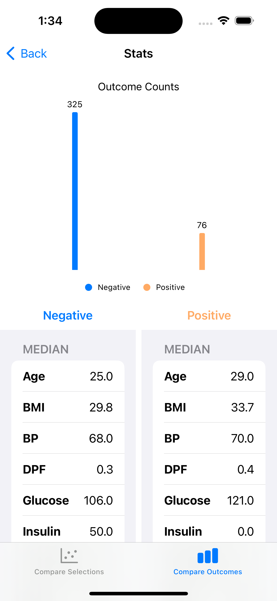

# ML Playground

The purpose of this app is to:

1. Deploy a ML model to run natively on the iPhone
1. Provide an intuitive way of interacting with the ML model
1. Display relationships with the data and machine learning model for both technical and non-technical users

This project contains a random forest classifier that is trained on a sample of data from the well-known Pima Indians Database [here](https://www.kaggle.com/datasets/uciml/pima-indians-diabetes-database). Apple's Core ML tools [library](https://apple.github.io/coremltools/docs-guides/source/overview-coremltools.html) is used to translate the Python model to the Core ML format.  The iOS app itself is written in Swift, using SwiftUI with the Charts and CoreML libaries.

A more comprehensive article documenting this application can be found [here](https://medium.com/@brandonknox_6151/multi-touch-ml-models-572f7cb27874).

# App Interface
## Main screen

- Sliders under the "Choose feature values" section allow for testing model predictions with different values for each feature
- The charts update to reflect data that nearly matches the user's selections
- The visible data can be increased by increasing the neighboring data slider

## Stats screens
### Compare selections

- Compare current selections made on main screen to median, min and max values of sampled data
- Scroll values on both left and right sides of screen

### Compare outcomes

- Compare sampled data's median, min and max values by positive/negative outcome
- Scroll values on both left and right sides of screen

# Swift / Python files
This project makes use of Python to create the model and SwiftUI to interface with it

## Updating / deploying model
To make edits to the model and export it in the core ML format, use the notebook file at python_data/feature-importances-ios.ipynb.  It will export a file called `DiabetesTest.mlmodel` that can be imported into the iOS app.

## Updating SwiftUI iOS app
Open the ML Slide.xcodeproj using Xcode.  Import the updated `DiabetesTest.mlmodel` file into the project.

# Data definitions

- __Pregnacies (preg):__ Number of pregnancies the patients
- __Body-Mass-Index (BMI)__  Measured in kg/m^2
- __Glucose level (glu):__  Plasma glucose concentraion a 2 hours in an orgal glucose tolerance test
- __Blood Pressure (bp):__ Diastolic blood pressure in mmHg
- __Skin Thickness (skin):__ Triceps skin fold thicknes in mm
- __Insulin level (insulin):__ 2-hour serum insulin (micro-U/ml)
- __Diabetes pedigree function (dpfunc)__
- __Age:__ (age) in Years